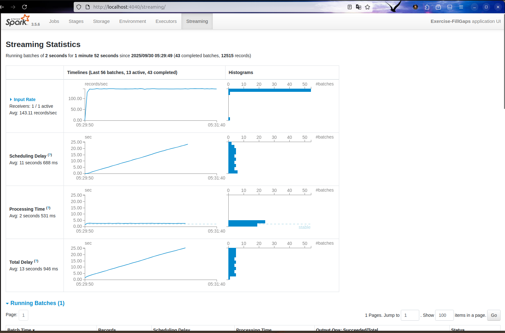
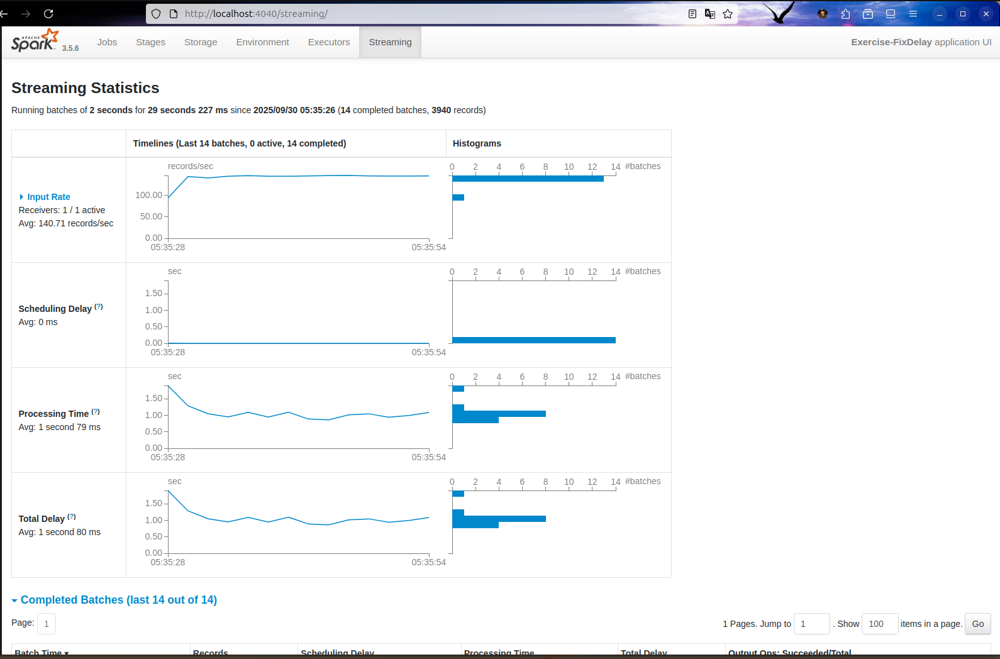

# Spark Streaming Performance Demo

## Tổng quan dự án
Demo về hiệu suất Spark Streaming với các kỹ thuật tối ưu hóa và xử lý bottleneck. Bao gồm 3 phase demo minh họa từ baseline → bottleneck → optimization, cùng với các bài tập thực hành.

## Cấu trúc thư mục
```
spark-streaming-performance/

├── docker-compose.yml           # Container orchestration
├── Dockerfile                   # Custom Spark image
├── .gitignore                   # Git ignore rules
│
├── demo/                        # Demo Performance (Slides 18-26)
│   ├── phase1_baseline.py       # Phase 1: Baseline (BI=2s, cores=4)
│   ├── phase2_slow_map.py       # Phase 2: Bottleneck (thêm sleep)
│   ├── phase3_parallelism.py    # Phase 3: Tối ưu (cores=8)
│   └── socket_source.py         # Socket server tạo dữ liệu test
│
├── spark/                       # Cấu hình Spark
│   └── spark-defaults.conf      # Spark configuration settings
│
├── exercises/                   # Bài tập thực hành
```

## Hướng dẫn sử dụng

### 1. Khởi động môi trường
```bash
# Build và khởi động containers
docker-compose up -d --build

# Kiểm tra containers đang chạy
docker-compose ps
```

### 2. Chạy demo performance

> **Lưu ý:** Cần chạy socket source trước khi chạy Spark jobs

#### **Terminal 1: Socket Source (Data Generator)**
```bash
# PowerShell hoặc CMD
docker exec -it spark-master python /opt/app/demo/socket_source.py
```
*Giữ terminal này mở - nó sẽ sinh dữ liệu liên tục*

#### **Terminal 2: Spark Streaming Jobs**
```bash
# Phase 1: Baseline (Processing Time < Batch Interval)
docker exec -it spark-master spark-submit /opt/app/demo/phase1_baseline.py

# Phase 2: Bottleneck (Processing Time > Batch Interval) 
docker exec -it spark-master spark-submit /opt/app/demo/phase2_slow_map.py

# Phase 3: Optimized (Tăng parallelism để giảm Processing Time)
docker exec -it spark-master spark-submit /opt/app/demo/phase3_parallelism.py

```

### 3. Truy cập Spark UI

| Service | URL | Mô tả |
|---------|-----|-------|
| **Spark Master UI** | http://localhost:8081 | Quản lý cluster, workers |
| **Spark Driver UI** | http://localhost:4040 | Monitoring jobs (khi job đang chạy) |


### 4. Bài tập thực hành – Exercise Fill Gaps

**Hoàn thiện code** `exercises/exercise_fill_gaps.py` **và** `exercises/exercise_fix_delay.py` để giải quyết yêu cầu bài tập.


#### Mục tiêu

* Hiểu quan hệ **Batch Interval (BI)** – **Processing Time (PT)** – **Scheduling Delay**.
* **Lượt chạy 1 (tạo delay):** cố tình làm chậm → PT > BI → Scheduling Delay tăng.
* **Lượt chạy 2 (fix delay):** tăng parallelism/giảm tải → PT < BI → Scheduling Delay ≈ 0.

#### Chuẩn bị

* Đảm bảo socket source đang chạy:

```bash
docker exec -it spark-master python /opt/app/demo/socket_source.py
# [socket_source] listening on 0.0.0.0:9999
```


---

#### **Bước 1 — Chạy bài tạo delay (Exercise-FillGaps)**

* File: `/opt/app/exercises/exercise_fill_gaps.py`
* Cấu hình chính: **BI = 2s**, **sleep = 15ms/record**, **repartition(4)**, **reduceByKey(..., 4)**

Chạy:

```bash
docker exec -it spark-master \
  spark-submit \
  --master local[4] \
  --conf spark.ui.port=4040 \
  /opt/app/exercises/exercise_fill_gaps.py
```

* Mở **Spark UI** (driver UI hiển thị khi job đang chạy):

  * [http://localhost:4040](http://localhost:4040)

**Quan sát trên UI › tab *Streaming***

* **Input Rate** ~ 140–150 rec/s ⇒ ~280–300 rec/batch với BI=2s.
* **Processing Time (PT)** ~ 1–2.5s (tuỳ máy). Nếu **PT > 2s** nhiều batch liên tiếp:

  * **Scheduling Delay** sẽ **tăng dần** (đường chéo đi lên).
  * **Queued Batches > 0** (có backlog).
* **Total Delay ≈ PT + Scheduling Delay**.


> **Hình 1 – “Before”:** PT ≳ BI, Scheduling Delay tăng.

---

#### **Bước 2 — Chạy bài fix delay (Exercise-FixDelay)**

* File: `/opt/app/exercises/exercise_fix_delay.py`
* Cấu hình gợi ý: **BI = 2s**, **sleep = 5ms/record**, **repartition(8)**, **reduceByKey(..., 8)**

Chạy:

```bash
docker exec -it spark-master \
  spark-submit \
  --master local[8] \
  --conf spark.ui.port=4040 \
  /opt/app/exercises/exercise_fix_delay.py
```

**Kỳ vọng trên UI**

* **Processing Time < 2s** rõ rệt (thường ~0.5–1.2s tuỳ máy).
* **Scheduling Delay = 0 ms** (đường phẳng), **Queued Batches = 0**.
* **Total Delay ≈ Processing Time**.


> **Hình 2 – “After”:** PT < BI, Scheduling Delay ≈ 0.
